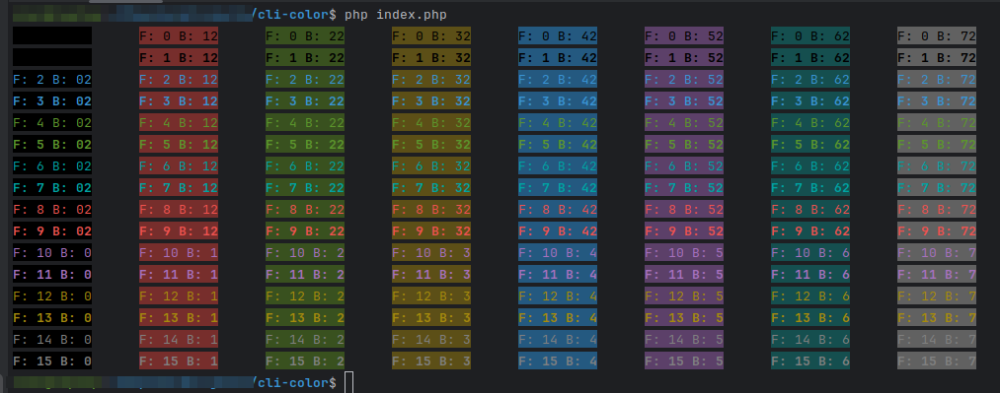

# PHP CLI Colored Output

Provides CLI colored output for PHP scripts.

## How To Use Example

In a nutshell:

```php
<?php

include_once 'Color.php';

echo Color::output("This is my string", Color::FOREGROUND_BLUE, Color::BACKGROUND_BLACK);
```

### Example Output

```php
<?php

include_once 'Color.php';

$foreground = [Color::FOREGROUND_BLACK, Color::FOREGROUND_DARK_GRAY, Color::FOREGROUND_BLUE, Color::FOREGROUND_LIGHT_BLUE, Color::FOREGROUND_GREEN, Color::FOREGROUND_LIGHT_GREEN, Color::FOREGROUND_CYAN, Color::FOREGROUND_LIGHT_CYAN, Color::FOREGROUND_RED, Color::FOREGROUND_LIGHT_RED, Color::FOREGROUND_PURPLE, Color::FOREGROUND_LIGHT_PURPLE, Color::FOREGROUND_BROWN, Color::FOREGROUND_YELLOW, Color::FOREGROUND_LIGHT_GRAY, Color::FOREGROUND_WHITE];

$background = [Color::BACKGROUND_BLACK, Color::BACKGROUND_RED, Color::BACKGROUND_GREEN, Color::BACKGROUND_YELLOW, Color::BACKGROUND_BLUE, Color::BACKGROUND_MAGENTA, Color::BACKGROUND_CYAN, Color::BACKGROUND_LIGHT_GRAY];

$f = 0;
foreach ($foreground as $fColor) {
    $b = 0;
    foreach ($background as $bColor) {
        echo Color::output(str_pad("F: $f B: $b",10,STR_PAD_BOTH), $fColor, $bColor);
        echo "\t";
        $b++;
    }
    echo "\n";
    $f++;
}
```



